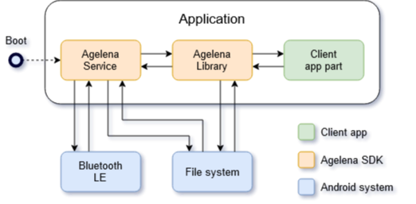

Agelena is a communication library based on Bluetooth Low Energy. Its goal is to easily send various message types through Bluetooth LE.

It has been developed in Kotlin for Android devices with an Android API level >= 23.

## Functionalities

### Identification

Each device using Agelena is identified by a unique 32-bit identifier. Like an IP address, it's used to identify the sender and recipient of a message. This id is generated randomly and do not change over time.

### Compression

To improve data transfer debit, all messages are compressed using the zlib algorithm.

### Encryption

Agelena implements two encryption systems : message encryption and session encryption.

Message encryption grants data security against intermediates who could access message data during store-and-forward. It uses a combination of RSA-2048 and AES-256 algorithms to efficiently protect data with asymmetric keys. Each device has a personal private key used to decipher received messages and a public key shared to nearby devices.
Message encryption doesn't apply to broadcast messages.

Session encryption grants data security against external sniffing attacks. It uses the AES-256 symmetric algorithm. A session between two nearby devices is created when they securely share, among others, a symmetric key during a handshake.

### Fragmentation

Bluetooth LE packets being small, most messages have to be fragmented. Agelena integrates a 16-bit sequence number to message fragments for the recipient to reconstruct the original message at delivery.

### Store-and-Forward

The advantage of Agelena library is that it'll do its best to reach message recipients. To achieve that, it implements a store-and-forward mechanism. If the recipient is not near the device when a message is sent, it'll store all message fragments and send them to other devices it encounters. These devices will also store fragments and propagate them to other devices until they reach their final recipient.

## How to Use It

The Agelena library has been developed with the aim of usage simplicity. Thus, the customer application only needs a few lines of code to use it.

### SDK Importation

There are two ways to import the SDK in app : import the .AAR file or import the sources.

To import the .AAR file, you have to copy it in the subfolder `/libs` of the module needing Agelena.
Then you have to add the following lines in the following files.

In the main `build.gradle`, in the section `allprojects > repositories ` :

```
flatDir {
  dirs 'libs/aars'
}
```

In the `build.gradle` file of the module, in the section `dependencies` :

```json
implementation files(’libs/agelena.aar’)
```


To directly import the sources in a project, you have to download the `android/agelena` folder and decompress it in the folder where your project modules are located.
Then, you have to add the following lines in the following files.

In `settings.gradle` :

```json
 include ’:agelena’
```

In the main `build.gradle`, in the section `buildscript > dependencies` :

```json
classpath "org.jetbrains.dokka:dokka-gradleplugin:0.10.1"
```

In the `build.gradle`file of the module needing Agelena, in the `dependencies`section :

```json
implementation project(’:agelena’)
```


Either way, do not forget to synchronize Gradle at the end of all operations.

After that, you have to add metadata needed by Agelena in the `AndroidManifest` of the app. To do that, add the following line in the `application` tag :

```xml
<meta-data android:name="ch.hepia.agelena.APP_UUID" android:value="[app-uuid]"/>
```

`[app-uuid]` must be a randomly generated UUID and be unique for each app.

### Permission

Agelena needs some permissions to work. These permissions have to be added in the `AndroidManifest `of the app :

```xml
<uses-permission android:name="android.permission.BLUETOOTH" />
<uses-permission android:name="android.permission.BLUETOOTH_ADMIN" />
<uses-permission android:name="android.permission.ACCESS_FINE_LOCATION" />
```

The following lines check for the permissions and request them if they are not given :

```kotlin
private fun requestPermissions(): Boolean {
    var all = true
    if (ContextCompat.checkSelfPermission(
            this, Manifest.permission.BLUETOOTH_ADMIN
        ) != PackageManager.PERMISSION_GRANTED
    ) {
        ActivityCompat.requestPermissions(
            this, arrayOf(
                Manifest.permission.BLUETOOTH,
                Manifest.permission.BLUETOOTH_ADMIN
            ), 0)
        all = false
    }
    if (ContextCompat.checkSelfPermission(
            this, Manifest.permission.ACCESS_FINE_LOCATION
        ) != PackageManager.PERMISSION_GRANTED
    ) {
        ActivityCompat.requestPermissions(
            this, arrayOf(Manifest.permission.ACCESS_FINE_LOCATION), 2)
        all = false
    }
    
    return all
}

override fun onRequestPermissionsResult(
    requestCode: Int,
    permissions: Array<out String>,
    grantResults: IntArray
) {
    if (grantResults.isNotEmpty()
        && grantResults[0] == PackageManager.PERMISSION_GRANTED
    ) {
        requestPermissions()
    } else {
        Toast.makeText(this, getString(R.string.permission_msg), Toast.LENGTH_LONG).show()
    }
}
```

### Initialization

Before using Agelena, you have to initialize it first. To this end, use the `Agelena.initialize(Context, StateListener, MessageListener)` method. If the initialization succeeded, you can start the components.

The following code initializes and starts Agelena :

```kotlin
val stateListener = object : StateListener {
    override fun onStartError() {
        ...
    }
    override fun onDeviceConnected(device: Device) {
        ...
    }
    override fun onDeviceLost(device: Device) {
        ...
    }
}

val messageListener = object : MessageListener {
    override fun onBroadcastMessageReceived(message: ch.hepia.agelena.message.Message) {
        ...
    }
    override fun onMessageSent(message: ch.hepia.agelena.message.Message) {
        ...
    }
    override fun onMessageFailed(message: ch.hepia.agelena.message.Message, errorCode: Int) {
        ...
    }
}
   
val e = Agelena.initialize(requireContext(), stateListener, messageListener)
if (e == Agelena.SUCCESS) {
    Agelena.start()
} else {
    Log.e(TAG, "Agelena failed to start. Error: $e")
}
```

### Library usage

To send a message, you can use this code :

```kotlin
val text = "A message text"

val map = mapOf<String, Any>(
    "type" to 1,
    "example" to 12.0
    "text" to text
)
val bytes = ByteArrayInputStream(ByteArray(20))

val msgA = Message.Builder().setRecipient(device).setContent(map).setData(bytes).build()
Agelena.sendMessage(msgA, Global.TTL)
```

`setContent` allows you to send data using key-value pairs and `setData` allows you to send raw data as an `InputStream`. You can either use one of them or use them both at a time.

To send broadcast messages, use `Agelena.sendBroadcastMessage`. This method doesn't need a recipient but needs a Time-To-Live corresponding to the number of intermediate devices it will reach before stopping.

To manage received messages, implement a `MessageListener` and give it to the `initialize` method. Its different listener methods will be called when a message is received or sent. 

Example of a message delivery :

```kotlin
override fun onMessageReceived(message: Message) {
    Log.d(TAG, "Message ${message.id} from ${message.senderId}")
    
    if (message.content["type"] == 1) {
        val text = message.content["text"]
        ...
    }
}
```

The `StateListener` works the same way. Its methods are called when Agelena starts or stops and when another device appears in range or is lost.

## Errors handling

Agelena may return three error types.

The first is an exception thrown when another method is called before `Agelena.initialize`. This will throw an `IllegalStateException` with the message : « Agelena must first be initialized ».

The second error type occurs when initialization fails. In this case, the `Agelena.initialize` method will return a negative number according to the following table :

| Value | Constant name               | Description                                                  |
| ----- | --------------------------- | ------------------------------------------------------------ |
| -1    | ERROR_GENERAL               | An unknown error occurred                                    |
| -2    | ERROR_MISSING_PERMISSIONS   | Needed permissions were not given                            |
| -3    | ERROR_BLUETOOTH_NOT_ENABLED | Bluetooth or location is not enabled                         |
| -4    | ERROR_BLE_NOT_SUPPORTED     | Current device does not support BLE                          |
| -5    | ERROR_INVALID_APP_UUID      | `ch.hepia.agelena.APP_UUID` metadata is not present in the `AndroidManifest` or is not a valid UUID |

The last error type occurs when a message fails to be sent. In this case, a negative number is sent to the user through the `MessageListener#onMessageFailed` listener method according to the following table :

| Value | Constant name                  | Description                                                  |
| ----- | ------------------------------ | ------------------------------------------------------------ |
| -10   | MESSAGE_ERROR_RECEIVER_EMPTY   | Message recipient was not given                              |
| -11   | MESSAGE_ERROR_OUT_OF_RANGE     | Direct message recipient is not in range                     |
| -12   | MESSAGE_ERROR_INVALID_TTL      | Broadcast message TTL is smaller than 1 or bigger than 255   |
| -13   | MESSAGE_ERROR_SELF             | Message recipient is the current device                      |
| -14   | MESSAGE_ERROR_NOT_STARTED      | Agelena is not started                                       |
| -15   | MESSAGE_ERROR_UNKNOWN_RECEIVER | Encryption is enabled but the public key of the recipient is unknown. A device must first have been in range to be able to send it encrypted messages. |

## SDK architecture

Agelena SDK is separated in two parts : the client library and the background service. The client part allows the user to interact with the library, and the service interacts with the Android system and the Bluetooth API. The service runs even if the app is not open.



## Full documentation

The full API documentation is accessible in HTML format in the [kdoc-agelena](kdoc-agelena) folder.

## License

Agelena is free software; you can redistribute it and/or modify it under the terms of the [GNU General Public License](http://www.gnu.org/licenses/gpl.html) as published by the Free Software Foundation; either version 3 of the License, or (at your option) any later version.

## Further information

For any further information, you can contact me at [jvonderweid@gmail.com](mailto:jvonderweid@gmail.com).
